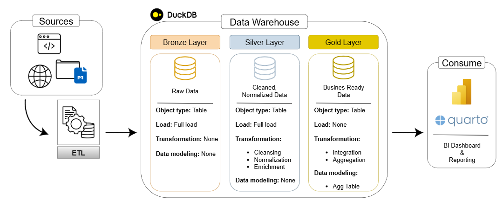
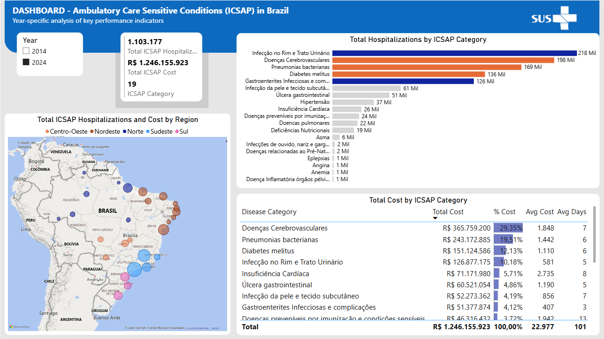
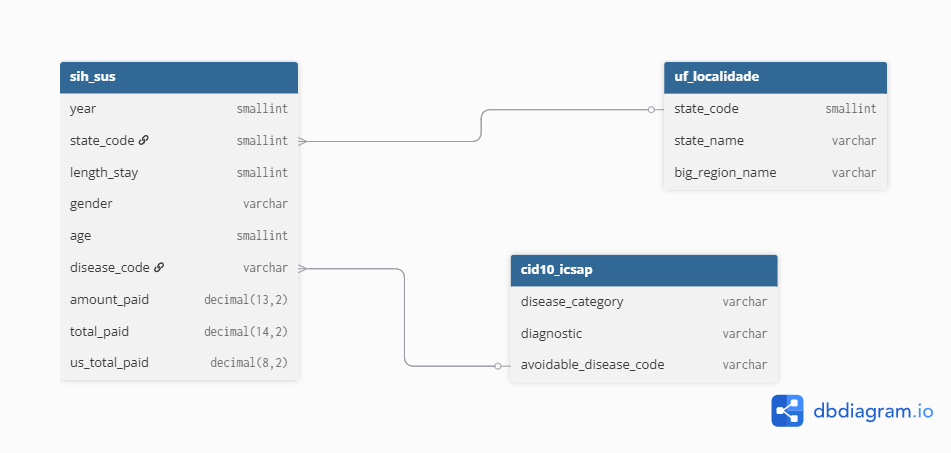

# In-Hospital Mortality Risk Prediction Using SIH-SUS Data
#### Welcome to the Project repository!

This is an end-to-end Data Science project that follows the SEMMA framework to structure the machine learning workflow, from data preparation and exploratory analysis to model training, evaluation, and deployment. The project is based on the Brazilian Hospital Information System (SIH) and focuses on Ambulatory Care Sensitive Conditions (ACSC/ICSAP) within the Unified Health System (SUS).

The project applies machine learning concepts such as feature selection, feature engineering, model selection, and model interpretability using SHAP. The final output is an interactive Streamlit application that runs the selected model and predict in-hospital mortality risk at admission time, aiming to support healthcare professionals in early stratification and more informed patient management. 



---

## Project Overview

This project involves:

1. **ETL/ELT Pipelines**: Extracting, transforming, loading data from source systems into a warehouse.
2. **Data Architecture**: Simulation of a data warehouse using Medallion Architecture Bronze, Silver, and Gold layers.
3. **Data Modeling**: Developing agregated tables optimized for analytical queries and machine learning workloads.
4. **Data Aanalysis**: SQL-based analytical report and dashboard for actionable insights into the clinical and financial impact.
5. **Data Science**: Developing a supervised machine learning model to solve a healthcare classification problem. 

---

### Data Science

A supervised machine learning model was developed to predict in-hospital mortality risk at admission time using clinical and administrative information available at hospitalization. The target variable is imbalanced, which required specific modeling strategies. [Access the app!](https://sih-sus-predict.streamlit.app/)

Developed in **Quarto** notebooks using specific **Python** libraries:
- **Pandas**: For data manipulation and exploratory analysis.
- **Scikit-learn**: For split datasets, preprocessing pipelines, evaluation metrics (ROC-AUC & F1-score) and hyperparameter tuning.  
- **Feature-engine**: Categorical encoding techniques like One-Hot-Encoding and Mean Encoding.
- **Imbalanced-learn**: For imbalance ensemble models such Balanced RF and Balanced Bagging Classifiers.
- **XGBoost** & **LightGBM**: Gradient boosting models.
- **SHAP**: Model interpretability.

For a complete view, refer to Project ML ([*html*](https://019b9fc6-5626-8f65-e0a1-60f288c3886a.share.connect.posit.cloud/) / [*qmd*](notebooks/ml/train.qmd)) files.

---

### Data Analysis

Exploratory Data Analysis was conducted to quantify the clinical and financial impact of ICSAP in the Brazilian SUS from 2014 to 2024, assessing data quality and generating insights to identify potential gaps on primary care.

Developed in **Quarto** notebooks using specific **Python** libraries:
- **DuckDB**: SQL-based queries for data access and analytical computations.
- **Pandas**: Data manipulation and exploratory analysis.
- **Matplotlib**, **Seaborn** & **Plotly**: Data visualization.

For a complete view, refer to Project EDA ([*html*](https://019b9fc3-a5db-9893-85a4-d82eee91c015.share.connect.posit.cloud/) / [*qmd*](notebooks/eda/eda_sih_sus.qmd)) files or the report ([*html*](https://019b9fc9-cbf8-b008-71ab-3a23a796c9aa.share.connect.posit.cloud/)) file.



Access the Power BI [dashboard](docs/sih_sus_icsap_dashboard.pbix) (*pbix* file)

---

### Data Architecture

- **Bronze Layer**: Stores raw data as-is from the source systems. Data is ingested from *Parquet* and *csv* files into DuckDB Database.
- **Silver Layer**: This layer includes data cleansing and normalization processes to prepare data for analysis.
- **Gold Layer**: Houses business-ready data modeled required for reporting and analytics.




---

### Data Sources

1. **SIH-SUS** data was extracted from two diferent sources:
    1. Data for 2014 to 2023 were downloaded from a [Kaggle](https://www.kaggle.com/datasets/victoremanuel/bigsus-sih-silver?select=SIH) dataset as *parquet* files.
    2. Data for 2024 was extracted from the DATASUS using the **microdatasus** library in R, partitionated by month and stored in *parquet* files. 
2. **ICSAP** data: The ICD-10 list codes and disease categories for Ambulatory Care Sensiteve Conditions in Brazil was web scraped from the Ministry of Health [page](https://bvsms.saude.gov.br/bvs/saudelegis/sas/2008/prt0221_17_04_2008.html) and stored in a *csv* file.
3. **BR States** information: The list with the Brazilian state codes and names was web scraped from the Brazilian Institute of Geography and Statistics [(IBGE)](https://www.ibge.gov.br/explica/codigos-dos-municipios.php#AC) and stored in a *csv* file.
4. **Other data**: The tables with all procedures, complexity and bed specialities information were downloaded from [Base dos Dados](https://basedosdados.org/dataset/ff933265-8b61-4458-877a-173b3f38102b?table=75db9d44-42be-42c5-9fbc-7591f4dc8d5f).

---

### Techinical Requirements

1. Python version 3.13.5 
2. R version 3.6.1

---

## Repository Structure
```
.
├── data/                                   # Contains all project data, raw and processed.
│   ├── raw/                                # (.gitignore) Raw, immutable data downloaded and extracted from sources.
│   └── tables_gold/                        # Processed and aggregated data tables from the Gold layer.
│
├── docs/                                   # Project documentS.
│   ├── sih_sus_icsap_dashboard.pbix        # Power BI dashboard output of the analysis.
│   └── ...                                 # ... (other plots and immages).
│
├── ml_app/                                 # Source of the ML application.
│   ├── app.py                              # Script with code for the streamlit app.
│   └── ...                                 # ... (other files related with the app)
│
├── notebooks/                              # Quarto notebooks for analysis.
│   ├── eda/                                # Exploratory Data Analysis.
│   │── ml/                                 # Machine learn notebook for train/test.
│   └── report/                             # Data Analysis Report.
│
├── src/                                    # Source code for the data pipeline.
│   ├── init_database.py                    # Create and initialize the database.
│   ├── 00_extract/                         # Scripts for data extraction and download.
│   ├── 01_bronze/                          # Scripts for the Bronze layer (raw data ingestion).
│   ├── 02_silver/                          # Scripts for the Silver layer (data cleaning and transformation).
│   └── 03_gold/                            # Scripts for the Gold layer (aggregated analytical tables).
│
├── .gitignore                              # Specifies files to be ignored by Git.
├── LICENSE                                 # Project license file.
├── README.md                               # This file: project overview and instructions.
├── requirements.txt                        # List of dependencies for the project.
└── sih_sus.duckdb                          # (.gitignore) The local DuckDB database file.
```

---

## License

This project is licensed under the [MIT License](LICENSE). You are free to use, modify, and share this project with proper attribution.