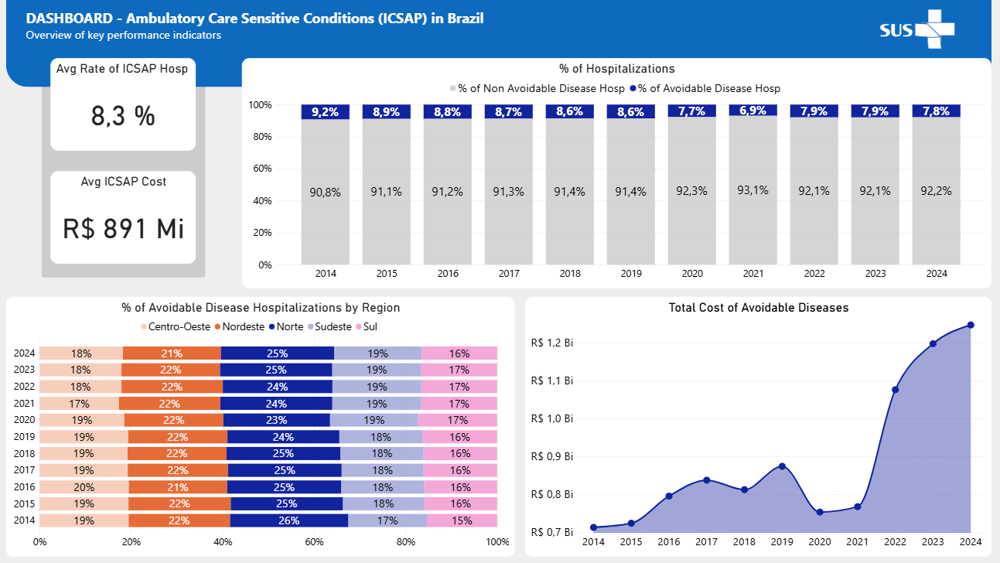

# Analysis of Ambulatory Care Sensitive Conditions in Brazil
### Data Warehouse and Analytics Project

Welcome to the **SIH-SUS Analysis Project** repository!
This project bilds an end-to-end data analysis strategy. It simulates a data warehouse and demonstrates a comprehensive analysis of key performance indicators for the Ambulatory Care Sensitive Conditions (ACSC) of the Brazilian (ICSAP) Unified Health System (SUS), especifically from the Hospital Information System (SIH). Designed as a portfolio project, it highlights industry best practices in data engineering and analytics.


---
## Project Overview

This project involves:

1. **Data Architecture**: Designing a Modern Data Warehouse Using Medallion Architecture **Bronze**, **Silver**, and **Gold** layers.
2. **ETL Pipelines**: Extracting, transforming, and loading data from source systems into the warehouse.
3. **Data Modeling**: Developing agregated tables optimized for analytical queries.
4. **Analytics & Reporting**: Creating SQL-based reports and dashboard for actionable insights.

---

### Techinical Requirements

1. **Python** and **R** for primary language.
2. **DuckDB** for the database warehouse architecture and **SQL**  as engine for analytical queries.
3. **Quarto** Notebooks for exploratory & data analysis and report.
4. **Power BI** for analytical dashboard.

---

### Data Sources

1. **SIH-SUS** data was extracted from two diferent sources:
    1. Data for 2014 to 2023 were imported from a [Kaggle](https://www.kaggle.com/datasets/victoremanuel/bigsus-sih-silver?select=SIH) dataset as *parquet* files.
    2. Data for 2024 was extracted from the DATASUS using the **microdatasus** library in R, partitionated by month and stored in *parquet* files. 
2. **ICSAP** data: The ICD-10 list codes and disease categories for Ambulatory Care Sensiteve Conditions in Brazil was web scraped from the Ministry of Health [page](https://bvsms.saude.gov.br/bvs/saudelegis/sas/2008/prt0221_17_04_2008.html) and stored in a *csv* file.
3. **BR States** information: The list with the Brazilian state codes and names was web scraped from the Brazilian Institute of Geography and Statistics [(IBGE)](https://www.ibge.gov.br/explica/codigos-dos-municipios.php#AC) and stored in a *csv* file.

---

### Data Architecture

- **Bronze Layer**: Stores raw data as-is from the source systems. Data is ingested from *Parquet* and *csv* files into DuckDB Database.
- **Silver Layer**: This layer includes data cleansing and normalization processes to prepare data for analysis.
- **Gold Layer**: Houses business-ready data modeled required for reporting and analytics.


---

### Exploratory & Data Analysis

EDA was caried to quantify the clinical and financial impact of ICSAP in the Brazilian SUS from 2014 to 2024, while assessing data quality and identifying inconsistencies to ensure robust insights on primary care gaps and potential cost savings.

It was made in **Quarto** notebooks using specific **Python** libraries:
- **DuckDB**: SQL-based queries for read the dataset and calculations.
- **Pandas**: For manipulate and analyse dataframes.
- **Matplotlib**, **Seaborn** & **Plotly**: Create data visualizations.

For a complete view, refer to Project EDA [(*html* file)](notebooks/eda/eda_sih_sus.html) or [(*qmd* file)](notebooks/eda/eda_sih_sus.qmd)

---

### Analytics & Reporting

Develop SQL-based analytics to deliver detailed insights into:
- **ICSAP Hospitalizations**
- **ICSAP Hospitalizations Cost**
- **Major ICSAP Disease Categories**

For a complete view:
- **[SIH-SUS Report](notebooks/report/report_sih_sus.html):** Access to the Project Report (*html* file)
- **[SIH-SUS Dashboard](docs/sih_sus_icsap_dashboard.pbix):** Access to the Power BI dashboard (*pbix* file)





---

## Repository Structure
```
.
├── data/                                   # Contains all project data, raw and processed.
│   ├── raw/                                # (.gitignore) Raw, immutable data downloaded and extracted from sources.
│   │   └── metadata.txt                    # Metadata and descriptions for the sih-sus raw data.
│   └── tables_gold/                        # Processed and aggregated data tables from the Gold layer.
│
├── docs/                                   # Project documentation.
│   ├── dashboard_sih_icsap_2024.png        # Power BI dashboard screenshot of page 2(2024).
│   └── dashboard_sih_icsap.png             # Power BI dashboard screenshot of page 1.
│   └── data_architecture.png               # Diagram of the data architecture.
│   └── data_integration.png                # Diagram of the data integration.
│   └── sih_sus_icsap_dashboard.pbix        # Power BI dashboard output of the analysis.
│
├── notebooks/                              # Quarto notebooks for analysis.
│   ├── eda/                                # Exploratory Data Analysis.
│   │   ├── eda_sih_sus.qmd                 # Quarto notebook with the main analysis.
│   │   ├── eda_sih_sus.html                # Rendered HTML output of the analysis.
│   │   ├── references.bib                  # Bibliography for the analysis.
│   │   └── nature.csl                      # Citation style for the references.
│   │
│   ├── report/                             # Data Analysis Report.
│       ├── report_sih_sus.qmd              # Quarto notebook with the analysis report.
│       ├── report_sih_sus.html             # Rendered HTML output of the report analysis.
│
├── src/                                    # Source code for the data pipeline.
│   ├── 00_extract/                         # Scripts for data extraction and download.
│   │   ├── download_sih-sus.R              # R script to download 2024 SIH-SUS data.
│   │   └── ...                             # ... (other scraping scripts)
│   │
│   ├── 01_bronze/                          # Scripts for the Bronze layer (raw data ingestion).
│   │   └── ingest_bronze.py                # Python script to ingest raw data.
│   │
│   ├── 02_silver/                          # Scripts for the Silver layer (data cleaning and transformation).
│   │   ├── ingestion_silver.py             # Main script for Silver layer transformations.
│   │   └── ...                             # ... (SQL scripts for specific transformations)
│   │
│   └── 03_gold/                            # Scripts for the Gold layer (aggregated analytical tables).
│       ├── ingestion_gold.py               # Main script to create aggregated tables.
│       └── ...                             # ... (SQL scripts for specific aggregations)
│
├── .gitignore                              # Specifies files to be ignored by Git.
├── LICENSE                                 # Project license file.
├── README.md                               # This file: project overview and instructions.
├── requirements.txt                        # List of dependencies for the project.
└── sih_sus.duckdb                          # (.gitignore) The local DuckDB database file.
```

---

## License

This project is licensed under the [MIT License](LICENSE). You are free to use, modify, and share this project with proper attribution.